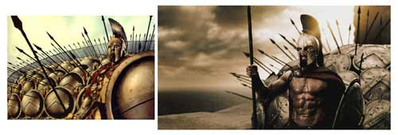
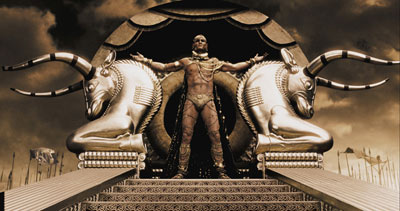

# Movie Review: **300**
## By Peyton Holt
Monday March 12, 2007

---

The great, desperate, one-sided battles of history – the [Alamo](https://en.wikipedia.org/wiki/Battle_of_the_Alamo), [Rorke’s Drift](https://en.wikipedia.org/wiki/Battle_of_Rorke%27s_Drift), Iwo Jima – are quickly drawn into myth. And it is through film, that most modern of myth-making mediums, that the oldest heroic battle of all, that of a handful of Spartans against the Persian army at [Thermopylae](https://en.wikipedia.org/wiki/Battle_of_Thermopylae), has been turned into 300, the movie that opened this weekend.

As in Roberto Rodriguez’s Sin City, director Zack Snyder has created a homage to Frank Miller’s original graphic novel, right down to the brushstrokes of blood. Visually, the film is a wonder: it continues and improves upon the respectful treatment that graphic novels have achieved in film in the last decade (starting with X-Men), using computer graphics seamlessly, at the level of art. This is where the technology should be: not to create clean, glittering spaceships in the darkness of space, but to achieve a majesty and field of vision that would otherwise be impossible, or ruinously expensive, to film, a way of transporting art from the printed page to celluloid honestly and compellingly.

From the beginning, the Spartan Dilio narrates the birth, training, and ascension of King Leonidas, the leader who is fated to lead his men into the Hot Gates. The film does not shirk from showing us the Spartans as flawed, tragic heroes: prideful, brutal and cold, the Spartan warriors are callous killing machines, glorying in battle and death, despising weakness and pity. It is only on the battlefield that their emotional true selves, their regrets and loves, visibly flicker to the surface before being snuffed out by death.

And it is in death – death in battle – that the Spartans seek their glory. Indeed, it is their wolfish eagerness for it, the sheer exuberance they take in expressing every sinew, every muscle, every skill they have in violent carnage, that is the hallmark of the movie, both horrifying and exhilarating. The editing, stunt and camera work are a marvel, soaking the screen in testosterone, the battle scenes balletic bloodletting filmed in proportions befitting Greek heroes (probably assisted by the fact that I saw the film in an IMAX theatre).

Snyder has expanded Miller’s original vision, adding more narrative before the battle and dividing the movie from the moment of the arrival of Xerxes emissary in Sparta, from whence he threatens all of Greece, between political intrigue at home (Queen Gorgo’s (Lena Headey) attempts to convince the Spartan council to send reinforcements to her husband) and the action of King Leonidas (Gerard Butler) bodyguard on the field of battle, simultaneously adding tension and slowing the movie.

The weaknesses of the comic – particularly in dialogue – are also writ large on screen. It is not for warrior-kings to be eloquent: the battle speeches are stirring, pithy, and suitably laconic, but Gorgo’s speeches (added by scriptwriters Snyder, Kurt Johnstad and Michael Gordon) are a poor fit.

With such an epic scope – and, let it be said, with Frank Miller’s own tendency for fascistic plotlines [\[1\]](#1.) – it is tempting to interpret 300 as a modern allegory. A lot of ink has been spilled in recent weeks in an attempt to draw the actions of men 2,500 years dead into parallel with modern life: indeed, with the United States currently engaged in battle with a significant portion of the Middle East, it is almost demanded that the reviewer do so.

To some degree the movie encourages this debate: the battle of the Greeks against the Persians is explicitly described as the struggle of rationality, democracy, and freedom against mysticism and tyranny. Conveniently, it avoids the uncomfortable truth of Western history: while the drafted Persian army is shown quite literally under the lash, 300 does little to make the viewer aware that the flower of our own democracy was equally grown on the bodies of slave labor.

But George W. Bush is not Xerxes, any more than he is Leonidas. The army that opposes the Greeks is Persian, not Iraqi. And the Persians, not the Greeks, are the invaders here.

The movie has also been critiqued for pitting white, heterosexual, attractive Greeks against Persians who are uniformly dark, exotic, and often grotesque. Part of this is historical whitewashing: Spartans were pederasts, at least from our cultural perspective. Part of it is historical truth: the Persian empire of Xerxes covered Iran, Syria, and parts of Asia and Northern Africa, and drew from the ethnic groups that lived in (and continued to inhabit) those lands. Another part is the attraction / repulsion the West has had with “Orientalism” since at least the Romantic era, if not the time of the Greeks. And more importantly, perhaps, is an excellent point made in Maryann (“the flick filosopher”) Johanson’s review of the film that deserves to be quoted in full:

“This exists in its own kind of mythic space much like the one that all ancient literature lived in for its listeners. Did the Persian king Xerxes really have monsters and orc-ninjas among his troops? Of course not. But that’s how it may have felt to the defenders of the Hot Gates, the long narrow pass that Leonidas and his 300 soldiers held for three days against an army of one million: terrifying and unknowable. Was Xerxes a giant? Of course not. But that’s probably what he felt like to the men facing his wrath magnified by a million.”

In other words, both the graphic novel and the film seek to recreate the psychological realism of the battle of the Hot Gates, not the retelling by Herodotus. At the same time, the film is very much aware of the power of myth: Dilios, as he narrates the birth and triumph of his king and countrymen, is already mythologizing the battle, little more than a year old. Tellingly, Xerxes’ gravest threat against Leonidas is not his death, but that with the triumph of the Persians he will obliterate the very memory of the battle, and of Sparta itself.

300 is a movie that barely seeks to rise above entertainment. Its lessons are sparse: a few men in the right place and the right time can make a difference. Courage has meaning. Myth is larger than any one of us. Accepted as such – and, as one reviewer put it, as “a spectacle of ass-kickin’”, 300 is a great time, and a fine movie.

### **Rating: ★★★★☆**

### 1.
I can hear the sound of Miller fanboys whetting their swords as I write this, so I will quickly define my terms: Miller is fascistic in the sense that his male characters tend to be Nietzschean supermen, focused with a will on the belief that “might makes right”. Leonidas is a hero, but he is also a benevolent tyrant; Batman is a hero, but he is also a vigilante. Miller's work also carries a lot of misogynistic baggage: his female characters tend to be whores, lesbians or otherwise male characters with a feminine appearance. 300, in its film and graphic form, do nothing to dispel these trends.